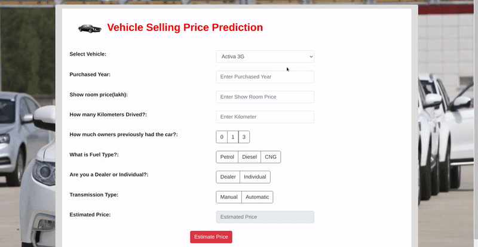

# Vehicle Selling Price Predictor using Machine Learning with Deployment on Heroku
  

## Introduction
• This project is about Vehicle Selling Price Prediction, In this project i will take some input from user and my machine learning model will predict selling price of vehicle.

### Tools and Technologies
• In this project i used cardekho.com dataset from kaggle.com, I had trained a **Machine Learning** model and i got **95.92%** accuracy using Random Forest Regressor.

• This repository consists of files required to deploy a ___Machine Learning Web App___ created with ___Flask___ on ___Heroku___ platform.

• If you want to view the deployed model, click on the following link: 
Deployed at: _https://kaggle.com/jaysoftic_

• If you are searching for __Code__, __Algorithms used__ and __Accuracy__ of the model.. you can find it in **vehicle selling price prediction.ipynb** file

• If you like my work and it helped you in anyway then please do ⭐ the repository it will motivate me to make more amazing projects. 

• A glimpse of the web app:

 
